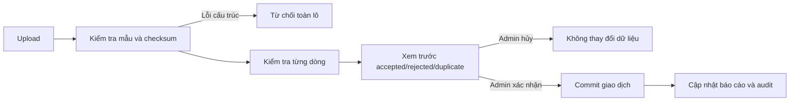

# Import Data Contract

## Common File Rules

- Chấp nhận bảng dữ liệu UTF-8/Unicode theo mẫu được phát hành; định dạng cụ thể CSV hoặc XLSX được chọn khi triển khai.
- Dòng đầu là tên trường chuẩn; không suy đoán cột chỉ dựa vào vị trí khi tên cột sai.
- Tiền VND dùng số nguyên không dấu phân cách hoặc kiểu số hợp lệ; không nhận chuỗi đã định dạng nếu không chuẩn hóa được chắc chắn.
- Ngày dùng một định dạng công bố duy nhất trong từng mẫu; thời điểm quan trắc bắt buộc có múi giờ hoặc cấu hình nguồn rõ ràng.
- Mỗi tệp có `batch_code`, `dataset_type`, `source_reference`, kỳ dữ liệu và checksum.

## Processing Contract

- Lỗi cấu trúc tệp từ chối toàn lô.
- Lỗi dữ liệu từng dòng được ghi rõ `row`, `field`, `error_code`, `message`.
- Chính sách partial import phải hiển thị trước xác nhận; mặc định chỉ commit dòng hợp lệ nếu Admin xác nhận rõ lô `PARTIAL`.
- Lô commit phải idempotent theo `batch_code` và khóa nghiệp vụ.
- Điều chỉnh dữ liệu đã xác nhận tạo phiên bản/bút toán bổ sung, không ghi đè lịch sử.

## Dataset Keys and Required Fields

### Workforce

**Business key**: `employee_code + effective_from`

Required: `employee_code`, `full_name`, `employment_status`, `unit_code`, `position_title`, `effective_from`.

### Duties

**Business key**: `employee_code + duty_code + effective_from`

Required: `employee_code`, `duty_code`, `duty_description`, `responsibility_type`, `effective_from`, `authority_source`.

### Tasks

**Business key**: `task_code`

Required: `task_code`, `title`, `owner_employee_code`, `assigned_at`, `priority`, `status`; `due_at` required unless `no_deadline_reason` supplied.

### Enterprises

**Business key**: `enterprise_code`; tax/registration code used as duplicate check.

Required: `enterprise_code`, `legal_name`, `status`.

### Invoices

**Business key**: `issuer_code + invoice_series + invoice_number`

Required: enterprise key, invoice key, `issue_date`, `due_date`, `currency`, line number, service category, line amount, status. Với ba loại thuê hằng năm, mỗi dòng bắt buộc có `obligation_year`.

### Payments

**Business key**: `payment_reference`

Required: `payment_reference`, enterprise key, `payment_date`, `amount`, status; allocation rows require invoice key, invoice line key/category, allocated amount và thời điểm phân bổ. Nếu hóa đơn có nhiều danh mục mà chưa xác định dòng được thanh toán, dòng phân bổ bị giữ ở trạng thái `UNALLOCATED` và không cộng vào số đã đóng của từng loại thuê.

### Monitoring Observations

**Business key**: `source_system + station_code + device_code + parameter_code + measured_at + source_record_key`

Required: station, device, parameter, raw value, raw unit, measured time, received time, source record key.

### Threshold Rules

**Business key**: `parameter_code + station_scope + effective_from`

Required: parameter, comparison, threshold values, unit, effective period, authority reference, approval status.

## Standard Error Codes

| Code | Meaning |
|---|---|
| `MISSING_REQUIRED` | Thiếu trường bắt buộc |
| `INVALID_FORMAT` | Sai định dạng ngày/số/mã |
| `UNKNOWN_REFERENCE` | Không tìm thấy mã liên kết |
| `DUPLICATE_IN_FILE` | Trùng trong cùng tệp |
| `DUPLICATE_EXISTING` | Trùng dữ liệu đã có |
| `INVALID_STATE_TRANSITION` | Chuyển trạng thái không hợp lệ |
| `AMOUNT_MISMATCH` | Tổng dòng/phân bổ không khớp |
| `UNIT_MISMATCH` | Đơn vị đo không hợp lệ/chưa có quy tắc đổi |
| `AUTHORITY_REQUIRED` | Thiếu căn cứ hoặc người xác nhận |
