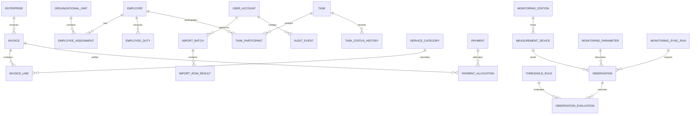
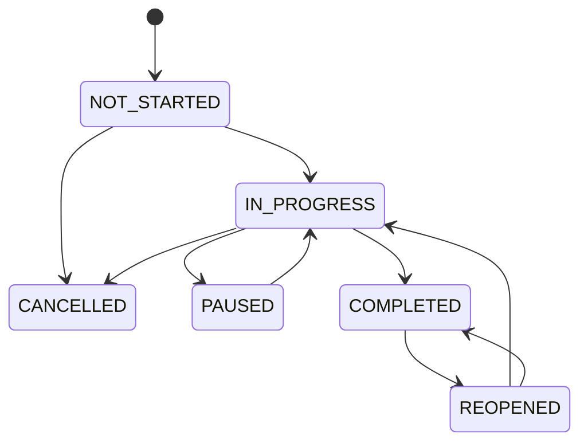

# Logical Data Model: Hệ thống quản trị hoạt động Trung tâm

**Feature**: `001-center-operations-management`  
**Purpose**: Mô hình dữ liệu logic; tên kiểu dữ liệu chỉ mang tính khái niệm, chưa phải migration hay schema triển khai.

## Relationship Overview

## Identity and Access

### UserAccount

| Field | Logical type | Rules |
|---|---|---|
| id | identifier | Immutable |
| username | text | Unique, normalized |
| role | enum | Exactly `DIRECTOR` or `DATA_ADMIN` in v1 |
| status | enum | `ACTIVE`, `LOCKED`, `DISABLED` |
| credential_reference | protected reference | Never exposed in reports/logs |
| failed_attempt_count | integer | Non-negative |
| last_login_at | timestamp | Nullable before first login |
| created_at / updated_at | timestamp | Audited |

**Validation**:

- Only one active account per role in v1.
- Role changes require an external authorized provisioning process; Admin cannot change roles.
- `DIRECTOR` has no write capability at the authorization boundary.

## Workforce

### Employee

| Field | Logical type | Rules |
|---|---|---|
| id | identifier | Immutable |
| employee_code | text | Unique and required |
| full_name | text | Required |
| date_of_birth | date | Optional; protected personal data |
| contact | text | Optional; protected personal data |
| employment_status | enum | `ACTIVE`, `ON_LEAVE`, `TRANSFERRED`, `ENDED` |
| effective_from / effective_to | date | Non-overlapping current record |
| source_batch_id | identifier | Required for imported records |

### OrganizationalUnit

| Field | Logical type | Rules |
|---|---|---|
| id | identifier | Immutable |
| unit_code | text | Unique |
| unit_name | text | Required |
| unit_type | enum | `OFFICE`, `TEAM`, `STATION`, `OTHER` |
| parent_unit_id | identifier | Optional; cannot create cycles |
| effective_from / effective_to | date | Supports historical structure |

### EmployeeAssignment

Links an employee to a unit and position for an effective period.

| Field | Logical type | Rules |
|---|---|---|
| employee_id | identifier | Required |
| unit_id | identifier | Required |
| position_title | text | Required |
| is_primary | boolean | At most one primary assignment per date |
| effective_from / effective_to | date | Must not invert dates |

### EmployeeDuty

| Field | Logical type | Rules |
|---|---|---|
| id | identifier | Immutable |
| employee_id | identifier | Required |
| duty_code | text | Unique within employee/effective period |
| duty_description | text | Required, explicit action wording |
| responsibility_type | enum | `LEAD`, `COORDINATE`, `SUPPORT` |
| authority_source | text/reference | Decision, assignment or approved description |
| effective_from / effective_to | date | Required start; optional end |

## Task Management

### Task

| Field | Logical type | Rules |
|---|---|---|
| id | identifier | Immutable |
| task_code | text | Unique |
| title / description | text | Required |
| source_reference | text | Optional document/decision reference |
| assigned_at | timestamp | Required |
| due_at | timestamp | Optional only when task truly has no deadline |
| priority | enum | `LOW`, `NORMAL`, `HIGH`, `URGENT` |
| current_status | enum | Derived from latest valid status event |
| completion_evidence | reference | Required when status becomes `COMPLETED`, unless justified |

### TaskParticipant

| Field | Logical type | Rules |
|---|---|---|
| task_id | identifier | Required |
| employee_id | identifier | Required |
| participant_role | enum | `OWNER`, `COORDINATOR`, `SUPPORTER` |
| assigned_from / assigned_to | timestamp | Preserves reassignment history |

### TaskStatusHistory

| Field | Logical type | Rules |
|---|---|---|
| id | identifier | Immutable, append-only |
| task_id | identifier | Required |
| from_status / to_status | enum | Must follow allowed transition |
| progress_percent | integer | 0–100; 100 only for `COMPLETED` |
| changed_at | timestamp | Required |
| entered_by | user identifier | In v1 normally Admin |
| reason / evidence | text/reference | Required for reopen, pause, cancel |

**State transitions**:

`OVERDUE` is not stored as a user-editable state. It is computed when `due_at` is past and current status is not `COMPLETED` or `CANCELLED`.

## Finance and Receivables

### ServiceCategory

Fixed initial codes:

| Code | Name |
|---|---|
| `WASTEWATER_TREATMENT` | Xử lý nước thải |
| `WASTE_TREATMENT` | Xử lý rác |
| `WASTE_TRANSPORT` | Vận chuyển rác |
| `OTHER_SERVICE` | Dịch vụ khác |
| `INFRASTRUCTURE_SERVICE_LEASE` | Thuê dịch vụ hạ tầng |
| `RAW_LAND_LEASE` | Thuê đất nguyên thổ |
| `INFRASTRUCTURE_ASSET_LEASE` | Thuê kết cấu hạ tầng |

### Enterprise

| Field | Logical type | Rules |
|---|---|---|
| id | identifier | Immutable |
| enterprise_code | text | Unique master code |
| tax_or_registration_code | text | Unique when supplied |
| legal_name | text | Required |
| display_name | text | Optional |
| status | enum | `ACTIVE`, `INACTIVE`, `MERGED` |
| merged_into_id | identifier | Required when merged |

### ReportingPeriod

| Field | Logical type | Rules |
|---|---|---|
| id | identifier | Immutable |
| period_type | enum | `MONTH`, `QUARTER`, `YEAR`, `CUSTOM` |
| start_date / end_date | date | Non-overlapping for same period type where required |
| data_status | enum | `OPEN`, `PARTIAL`, `CONFIRMED`, `LOCKED` |
| confirmed_at | timestamp | Required for confirmed/locked |

### Invoice

| Field | Logical type | Rules |
|---|---|---|
| id | identifier | Immutable |
| invoice_number | text | Unique with issuer/series |
| enterprise_id | identifier | Required |
| issue_date / due_date | date | Due date cannot precede issue date unless documented |
| currency | text | `VND` in initial scope |
| gross_amount | money | Non-negative |
| status | enum | `DRAFT`, `ISSUED`, `PART_PAID`, `PAID`, `OVERDUE`, `CANCELLED`, `REPLACED` |
| replacement_invoice_id | identifier | Optional; no cycles |
| source_batch_id | identifier | Required for imported data |

### InvoiceLine

| Field | Logical type | Rules |
|---|---|---|
| invoice_id | identifier | Required |
| line_number | integer | Unique per invoice |
| service_category_id | identifier | Required |
| description | text | Required |
| quantity / unit_price | decimal/money | Optional if line amount supplied |
| line_amount | money | Non-negative except approved reversal |
| revenue_period_id | identifier | Required after period rule is approved |
| obligation_year | year | Required for the three annual lease categories |

### Payment

| Field | Logical type | Rules |
|---|---|---|
| id | identifier | Immutable |
| payment_reference | text | Unique source reference |
| enterprise_id | identifier | Required |
| payment_date | date | Required |
| amount | money | Positive; reversals use linked adjustment |
| status | enum | `RECEIVED`, `REVERSED`, `PENDING` |
| source_batch_id | identifier | Required |

### PaymentAllocation

Allocates one payment across one or more invoices.

| Field | Logical type | Rules |
|---|---|---|
| payment_id | identifier | Required |
| invoice_id | identifier | Same enterprise as payment |
| invoice_line_id | identifier | Required when invoice contains multiple categories; determines paid category |
| allocated_amount | money | Positive; total cannot exceed received amount |
| allocated_at | timestamp | Required for annual paid and cutoff reporting |

### FinancialAdjustment

| Field | Logical type | Rules |
|---|---|---|
| id | identifier | Immutable |
| invoice_id | identifier | Required |
| adjustment_type | enum | `INCREASE`, `DECREASE`, `REVERSAL` |
| amount | money | Positive magnitude |
| effective_date | date | Required |
| reason / source_reference | text | Required |

**Derived balances**:

- `invoice_receivable = issued_amount + increases - decreases - reversals`
- `invoice_outstanding = max(0, invoice_receivable - valid_payment_allocations)`
- `enterprise_outstanding = sum(invoice_outstanding for non-cancelled invoices)`
- `annual_lease_due = sum(eligible invoice lines by enterprise + obligation_year + lease category)`
- `annual_lease_paid = sum(valid payment allocations to those invoice lines through cutoff date)`
- `annual_lease_outstanding = annual_lease_due - annual_lease_paid - valid category-level decreases/reversals`

Khoản thu chưa phân bổ tới dòng hóa đơn của hóa đơn nhiều danh mục được ghi nhận là `UNALLOCATED`; không được tính vào “đã đóng” của một loại thuê cho tới khi có phân bổ được xác nhận.

## Monitoring

### MonitoringStation

| Field | Logical type | Rules |
|---|---|---|
| id | identifier | Immutable |
| station_code | text | Unique |
| station_name | text | Required |
| industrial_zone | text/reference | Required |
| operator_unit | text/reference | Records actual operating unit |
| status | enum | `ACTIVE`, `MAINTENANCE`, `INACTIVE` |
| effective_from / effective_to | date | Required start |

### MeasurementDevice

| Field | Logical type | Rules |
|---|---|---|
| id | identifier | Immutable |
| station_id | identifier | Required |
| device_code | text | Unique within station/time |
| manufacturer / model | text | Optional until inventory complete |
| serial_number | text | Unique when available |
| expected_interval_seconds | integer | Positive |
| status | enum | `ONLINE`, `OFFLINE`, `FAULT`, `MAINTENANCE`, `RETIRED` |
| effective_from / effective_to | timestamp | Supports replacement |

### MonitoringParameter

| Field | Logical type | Rules |
|---|---|---|
| id | identifier | Immutable |
| parameter_code | text | Unique canonical code |
| parameter_name | text | Required |
| canonical_unit | text | Required |
| allowed_min / allowed_max | decimal | Technical plausibility bounds, not legal thresholds |

### Observation

| Field | Logical type | Rules |
|---|---|---|
| id | identifier | Immutable, append-only |
| station_id / device_id / parameter_id | identifier | Required and mutually consistent |
| measured_at | timestamp with timezone | Required |
| received_at | timestamp with timezone | Required; may be later than measured time |
| raw_value / raw_unit | decimal/text | Preserved from source |
| normalized_value / canonical_unit | decimal/text | Derived when conversion is approved |
| source_record_key | text | Unique with source system/device |
| quality_status | enum | `VALID`, `MISSING_GAP`, `DUPLICATE`, `INVALID`, `DEVICE_FAULT`, `LATE` |
| sync_run_id | identifier | Required for Premier API data |
| source_batch_id | identifier | Only for separately approved file fallback |

### MonitoringSyncRun

One scheduled or manually retried pull from the authorized Premier API.

| Field | Logical type | Rules |
|---|---|---|
| id | identifier | Immutable |
| source_portal | text | Premier business source URL |
| api_route_reference | protected text | Actual route supplied by Premier; never infer from page URL |
| started_at / finished_at | timestamp | Required after run ends |
| status | enum | `SUCCESS`, `PARTIAL`, `AUTH_ERROR`, `RATE_LIMITED`, `PROVIDER_ERROR`, `SCHEMA_ERROR`, `STALE` |
| checkpoint_before / checkpoint_after | protected text | Cursor/page/watermark; do not log tokens |
| records_received / accepted / rejected / duplicate | integer | Non-negative and internally consistent |
| response_checksum | text | Detects repeated/changed payloads |
| error_summary | text | Redacted, actionable, no credential/token |

### ObservationCorrection

Append-only correction; never overwrites Observation.

| Field | Logical type | Rules |
|---|---|---|
| observation_id | identifier | Required |
| corrected_value / unit | decimal/text | Required |
| reason / authority_reference | text | Required |
| entered_by / entered_at | user/timestamp | Required |

### ThresholdRule

| Field | Logical type | Rules |
|---|---|---|
| id | identifier | Immutable |
| parameter_id | identifier | Required |
| station_scope | identifier/list | Global or specified stations |
| comparison | enum | `GT`, `GTE`, `LT`, `LTE`, `RANGE` |
| threshold_value(s) / unit | decimal/text | Required |
| effective_from / effective_to | timestamp | Versions cannot ambiguously overlap |
| authority_reference | text/reference | Required |
| approval_status | enum | `DRAFT`, `APPROVED`, `RETIRED` |

### ObservationEvaluation

| Field | Logical type | Rules |
|---|---|---|
| observation_id | identifier | Required |
| threshold_rule_id | identifier | Nullable when no approved rule exists |
| result | enum | `NORMAL`, `EXCEEDED`, `UNKNOWN` |
| evaluated_at | timestamp | Required |

## Imports and Audit

### ImportBatch

| Field | Logical type | Rules |
|---|---|---|
| id | identifier | Immutable |
| batch_code | text | Unique |
| dataset_type | enum | Workforce, tasks, finance, invoices, payments, monitoring, thresholds |
| original_filename | text | Required for file import |
| file_checksum | text | Unique warning key with dataset type |
| status | enum | `UPLOADED`, `VALIDATED`, `REJECTED`, `CONFIRMED`, `COMMITTED`, `PARTIAL`, `REVERSED` |
| uploaded_by / uploaded_at | user/timestamp | Required |
| total/success/error counts | integer | Non-negative and internally consistent |
| source_reference | text | Required for accountable origin |

### ImportRowResult

| Field | Logical type | Rules |
|---|---|---|
| batch_id / row_number | identifier/integer | Unique pair |
| business_key | text | Required when derivable |
| outcome | enum | `ACCEPTED`, `REJECTED`, `SKIPPED_DUPLICATE`, `ADJUSTED` |
| error_code / error_field / message | text | Required for rejected rows |

### AuditEvent

| Field | Logical type | Rules |
|---|---|---|
| id | identifier | Immutable, append-only |
| actor_user_id | identifier | Nullable only for trusted system ingest |
| event_type | text/enum | Login, import, confirm, adjust, export, config change |
| entity_type / entity_id | text/identifier | Required for data changes |
| occurred_at | timestamp | Required |
| before_summary / after_summary | protected structured data | Redact credentials/secrets |
| reason / correlation_id | text | Required for sensitive adjustments |

## Retention and Deletion Rules

- Confirmed financial, monitoring, task-history, import and audit records are never physically deleted through normal UI.
- Employee and enterprise records are deactivated/effective-dated; history remains referentially intact.
- Draft data may be discarded before confirmation if no report has consumed it; the discard action is still audited.
- Concrete retention durations are deferred to approved policy before implementation.
