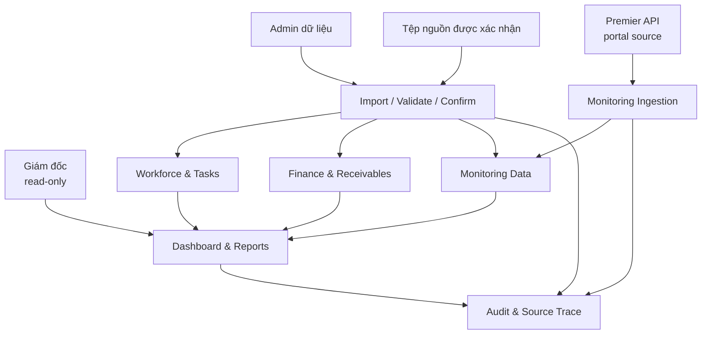
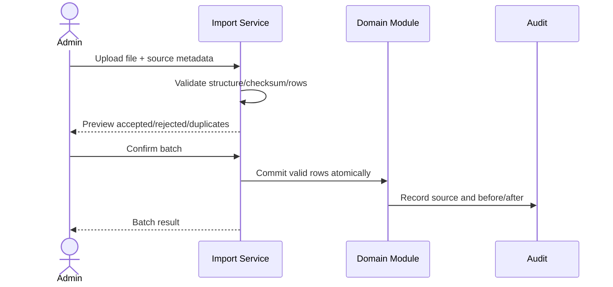

# Implementation Plan: Hệ thống quản trị hoạt động Trung tâm Dịch vụ công ích

**Branch**: `001-center-operations-management` (feature directory; chưa tạo nhánh Git) | **Date**: 2026-08-28 | **Spec**: [spec.md](spec.md)

**Input**: Feature specification from `specs/001-center-operations-management/spec.md`

**Implementation boundary**: Đã bắt đầu implementation nền tảng database theo plan. Frontend/backend nghiệp vụ chưa được tạo.

## Summary

Xây dựng một webapp nội bộ để Giám đốc xem báo cáo điều hành chỉ đọc và một Admin nhập/điều chỉnh dữ liệu có nguồn. Hệ thống bao phủ bốn miền: nhân sự và nhiệm vụ; doanh thu theo bảy danh mục; hóa đơn, số tiền doanh nghiệp đã đóng hằng năm cho ba loại thuê và công nợ còn lại; quan trắc nước thải KCN lấy định kỳ từ Premier API. Mọi số tổng hợp phải truy ngược được tới dữ liệu nguồn, mọi thay đổi phải có audit, và dữ liệu quan trắc gốc phải bất biến.

Giải pháp logic dùng một ứng dụng hợp nhất theo module, một nguồn dữ liệu quan hệ chính và một quy trình import staging/validation/commit. Premier API là nguồn quan trắc chính; hệ thống giữ checkpoint, payload gốc và trạng thái freshness, tránh crawl HTML hoặc phụ thuộc trực tiếp vào từng hãng máy ở giai đoạn plan.

## Technical Context

**Language/Version**: Database PostgreSQL 16.4; backend Node.js 22 + TypeScript 5  
**Primary Dependencies**: Docker Compose; Fastify; pg; bcryptjs; seed generator đọc XLS/XLSX an toàn  
**Storage**: PostgreSQL quan hệ; số đo/audit append-only về mặt logic  
**Testing**: Node test runner/tsx cho health, authentication, authorization; tiếp tục bổ sung acceptance, import idempotency, financial reconciliation, monitoring quality và recovery scenarios  
**Target Platform**: Docker trên máy vận hành; webapp nội bộ chạy trên trình duyệt máy tính; giao diện Giám đốc có thể responsive nhưng mobile app native ngoài phạm vi  
**Project Type**: Internal web application  
**Performance Goals**: Dashboard kỳ thông thường hiển thị trong 5 giây; kiểm tra lô 10.000 dòng trong 2 phút; truy vết số tổng hợp trong tối đa 3 thao tác; mỗi chu kỳ Premier sync có checkpoint và báo freshness  
**Constraints**: Hai tài khoản; Director read-only; Admin data-entry only; audit bắt buộc; quan trắc gốc bất biến; Premier API cần tài liệu/quyền truy cập được xác nhận; không tự gán Trung tâm làm chủ quản dữ liệu ngoài phạm vi được giao  
**Scale/Scope**: Giả định ban đầu tối đa 500 hồ sơ nhân sự, 100.000 hóa đơn/dòng tài chính mỗi năm, 50 thiết bị và tần suất thấp nhất 1 số đo/5 phút/thông số; phải đo lại sau kiểm kê  

## Constitution Check

*GATE: Checked before Phase 0 and re-checked after Phase 1.*

Constitution hiện là template chưa được phê chuẩn, nên chưa có nguyên tắc dự án có hiệu lực để đối chiếu. Plan áp dụng các gate tối thiểu sau:

| Gate | Result | Evidence |
|---|---|---|
| Database implementation giữ đúng phạm vi plan | PASS | Docker Compose, migration và seed chỉ bao phủ nền tảng dữ liệu |
| Phân quyền tối thiểu và kiểm tra phía xử lý dữ liệu | PASS | [permissions contract](contracts/permissions.md) |
| Mọi thay đổi có nguồn và audit | PASS | ImportBatch/AuditEvent trong [data model](data-model.md) |
| Không ghi đè dữ liệu tài chính/quan trắc đã xác nhận | PASS | Adjustment/correction append-only |
| Số báo cáo truy vết tới dữ liệu nguồn | PASS | [reporting contract](contracts/reporting.md) |
| Không vượt phạm vi trách nhiệm của Trung tâm | PASS | Quyết định số 9 trong [research](research.md) |
| Không còn unknown chặn thiết kế logic | PASS | Các quyết định kỹ thuật/thiết bị được deferred rõ, không ảnh hưởng mô hình logic |

**Post-design re-check**: PASS. Data model và contracts giữ nguyên các gate trên. Trước implementation phải thay constitution template bằng nguyên tắc được người có thẩm quyền phê duyệt.

## Logical Architecture



### Module Boundaries

| Module | Owns | Does not own |
|---|---|---|
| Identity & Access | Hai tài khoản, phiên, role checks | Hồ sơ nhân sự nghiệp vụ |
| Imports | Staging, validation, preview, commit, row errors | Tự quyết định quy tắc nghiệp vụ |
| Workforce | Nhân sự, đơn vị, chức danh, chức năng/nhiệm vụ | Chấm công/lương/bảo hiểm |
| Tasks | Nhiệm vụ, người tham gia, trạng thái, bằng chứng | Quy trình phê duyệt nhiều cấp chưa được yêu cầu |
| Finance | Danh mục, doanh nghiệp, hóa đơn, khoản thu, điều chỉnh | Sổ cái/kê khai thuế |
| Monitoring | Premier sync, checkpoint, trạm, thiết bị, thông số, số đo, gap, evaluation | Điều khiển thiết bị hoặc crawl HTML |
| Reports | Metrics, filters, drill-down, export metadata | Dữ liệu nguồn độc lập |
| Audit & Recovery | Audit events, backup/restore evidence | Ghi bí mật hoặc dữ liệu nhạy cảm không cần thiết |

## Core Logic Flows

### 1. Data Import



Rules:

1. Không commit trước khi Admin xác nhận.
2. Lô/từng dòng có khóa chống trùng.
3. Dữ liệu lỗi không tham gia báo cáo.
4. Điều chỉnh dữ liệu đã xác nhận tạo lịch sử, không ghi đè.

### 2. Director Reporting

1. Director chọn kỳ và bộ lọc.
2. Report service chỉ dùng nguồn dữ liệu đủ điều kiện theo trạng thái kỳ.
3. Trả cards/charts/tables cùng một filter context.
4. Mỗi card hỗ trợ drill-down tới bản ghi nguồn.
5. Mọi endpoint ghi bị từ chối cho Director dù giao diện không hiển thị nút.

### 3. Task Lifecycle

1. Admin import hồ sơ nhiệm vụ đã được giao từ nguồn có thẩm quyền.
2. Task được liên kết người phụ trách và phối hợp đang có hiệu lực.
3. Cập nhật trạng thái tạo `TaskStatusHistory`.
4. `OVERDUE` được tính tự động từ `due_at`; `COMPLETED` yêu cầu bằng chứng hoặc lý do miễn.
5. Mở lại/hủy/tạm dừng bắt buộc có lý do.

### 4. Receivable Calculation

1. Import enterprise master, invoices/lines, payments và allocations.
2. Kiểm tra tổng dòng hóa đơn, trạng thái hủy/thay thế và tổng phân bổ khoản thu tới từng dòng/danh mục.
3. Tính phải thu ở cấp hóa đơn; với ba loại thuê tổng hợp số phải đóng, đã đóng và còn nợ theo doanh nghiệp–năm nghĩa vụ–loại thuê.
4. Đánh dấu quá hạn từ due date và balance hiện tại.
5. Drill-down luôn hiển thị invoice/payment/adjustment nguồn.

### 5. Monitoring

1. Scheduler gọi Premier API theo credential được cấp, giữ checkpoint/pagination và raw response.
2. Xác thực mã trạm/thiết bị/thông số, đơn vị, timestamp và khóa nguồn.
3. Lưu bản gốc append-only; trùng thì ghi outcome nhưng không tạo số đo thứ hai.
4. Retry lỗi tạm thời, dừng retry lỗi auth/schema và hiển thị freshness.
5. Chuẩn hóa đơn vị khi có quy tắc được duyệt.
6. Phát hiện gap theo tần suất thiết bị hoặc metadata Premier đã xác nhận.
7. Đánh giá với phiên bản ngưỡng hiệu lực; thiếu ngưỡng trả `UNKNOWN`.
8. Báo cáo tách chất lượng dữ liệu khỏi trạng thái vượt ngưỡng.

## Project Structure

### Documentation (this feature)

```text
specs/001-center-operations-management/
├── spec.md
├── plan.md
├── research.md
├── data-model.md
├── quickstart.md
├── checklists/
│   └── requirements.md
└── contracts/
    ├── permissions.md
    ├── import-data.md
    ├── reporting.md
    └── monitoring-data.md
```

### Source Code

Không tạo source tree trong phase này. Khi được phép implementation, cấu trúc tối thiểu dự kiến chỉ gồm một frontend, một backend và tests, chia module theo miền nghiệp vụ; không tạo microservices hoặc abstraction dự phòng.

```text
frontend/        # UI Director/Admin
backend/         # identity, imports, workforce, tasks, finance, monitoring, reports, audit
tests/           # authorization, contract, integration, acceptance
```

**Structure Decision**: Modular monolith là mặc định vì chỉ có hai tài khoản và các miền phải giao dịch/đối chiếu chặt chẽ. Chỉ tách dịch vụ quan trắc riêng nếu đo tải thực tế chứng minh ingest ảnh hưởng webapp.

## Delivery Phases

### Phase A — Governance and Source Inventory

**Outcome**: Có chủ sở hữu dữ liệu, mẫu import và quy tắc báo cáo được ký xác nhận.

- Xác nhận hai tài khoản, người giữ tài khoản và quy trình mở khóa/thay người.
- Lập danh mục nguồn nhân sự, nhiệm vụ, doanh thu, hóa đơn, thanh toán và quan trắc.
- Chốt master codes: employee, unit, enterprise, invoice, category, station, device, parameter.
- Chốt ngày/kỳ doanh thu, công nợ, ngưỡng và retention.
- Nhận endpoint/API contract, quyền truy cập và quy tắc gọi Premier; đối chiếu mapping trạm/thiết bị/thông số.

**Gate**: Không sang implementation nếu chưa có người xác nhận nghiệp vụ cho từng nguồn.

### Phase B — Identity, Import and Audit Foundation

**Outcome**: Hai vai trò an toàn; import staging/preview/commit; audit và backup foundation.

- Triển khai role matrix và deny-by-default.
- Triển khai import batch/row results/idempotency.
- Triển khai audit trail và source trace.
- Chứng minh Director không thể ghi và import lại không cộng đôi.

### Phase C — Workforce and Tasks

**Outcome**: Báo cáo số người làm việc, hồ sơ chức năng nhiệm vụ và tiến độ công việc.

- Import master nhân sự/đơn vị/chức danh/duty.
- Import task, participant và status history.
- Dashboard headcount/task status/overdue và drill-down.

### Phase D — Finance and Receivables

**Outcome**: Doanh thu bảy danh mục; số phải đóng/đã đóng/còn nợ hằng năm của ba loại thuê theo doanh nghiệp; công nợ truy vết theo hóa đơn.

- Import enterprise, invoices/lines có năm nghĩa vụ, payments/allocations tới dòng hóa đơn và adjustments.
- Đối chiếu calculation và xử lý hủy/thay thế.
- Dashboard revenue/debt/overdue và báo cáo ba loại thuê theo doanh nghiệp–năm với filter thống nhất.

### Phase E — Monitoring

**Outcome**: Đồng bộ Premier API và theo dõi trạm, thiết bị, số đo, freshness, gap và vượt ngưỡng.

- Nhận tài liệu/API access từ Premier và lập mapping contract trước khi code.
- Bắt đầu bằng fixture phản hồi API Premier để xác nhận pagination, idempotency, auth và schema.
- Kết nối môi trường thật sau khi fixture và kiểm thử đồng bộ đã đạt.
- Bảo toàn raw observations, quality flags và threshold versions.
- Dashboard trends/data freshness/exceedances.

### Phase F — Acceptance and Operational Readiness

**Outcome**: Hệ thống đủ điều kiện đề nghị đưa vào vận hành.

- Chạy toàn bộ [quickstart](quickstart.md).
- Đối chiếu báo cáo với nguồn độc lập do nghiệp vụ xác nhận.
- Kiểm thử quyền, audit, backup/restore và dữ liệu thiếu/trùng.
- Lập hướng dẫn Admin và Giám đốc; bàn giao trách nhiệm vận hành.

## Risks and Controls

| Risk | Impact | Control |
|---|---|---|
| “Admin chỉ import” mâu thuẫn nhu cầu quản lý nhiệm vụ | Không ai cập nhật tiến độ | Giai đoạn đầu mọi cập nhật qua import/adjustment; chỉ thêm tài khoản nhân viên khi có yêu cầu mới |
| Sai master enterprise/invoice | Công nợ phân mảnh/cộng đôi | Unique business keys, merge workflow, reconciliation |
| Chưa rõ quy tắc kỳ doanh thu | Báo cáo năm sai | Gate nghiệp vụ trước Phase D |
| Premier API thay đổi/không truy cập được | Dữ liệu quan trắc stale hoặc lỗi | Checkpoint, raw payload, retry bounded, schema quarantine và freshness |
| Mất dữ liệu bị hiểu là 0 | Cảnh báo sai | Separate quality state; no synthetic zero |
| Ngưỡng thiếu/thay đổi | Đánh giá sai lịch sử | Versioned approved rules; `UNKNOWN` when absent |
| Constitution chưa phê chuẩn | Thiếu chuẩn quản trị dự án | Phê chuẩn constitution trước implementation |
| Chỉ có một Admin | Gián đoạn khi vắng mặt | Xác định quy trình thay người/khôi phục tài khoản ngoài ứng dụng; không tự mở rộng account count |

## Complexity Tracking

Không có vi phạm cần biện minh. Kiến trúc logic giữ ở một ứng dụng hợp nhất; các đường ingest dùng cùng hợp đồng dữ liệu và không tạo dịch vụ riêng khi chưa có bằng chứng tải.

## Pre-Implementation Approval Checklist

- [ ] Giám đốc xác nhận dashboard và đúng phạm vi chỉ đọc.
- [ ] Người phụ trách dữ liệu xác nhận Admin chỉ nhập/điều chỉnh có nguồn.
- [ ] Tổ chức Trung tâm và master nhân sự đã được chốt.
- [ ] Kế toán/nghiệp vụ xác nhận quy tắc doanh thu, hóa đơn, thanh toán và công nợ.
- [ ] Chuyên môn xác nhận trạm, thiết bị, thông số, tần suất và ngưỡng.
- [ ] Premier/đơn vị có quyền cung cấp endpoint API, schema, authentication, pagination, rate limit và timezone.
- [ ] Đơn vị có thẩm quyền xác nhận vai trò quản lý/phối hợp dữ liệu của Trung tâm.
- [ ] Constitution dự án được phê chuẩn.
- [ ] Người dùng phê duyệt plan này trước khi tạo tasks hoặc code.
